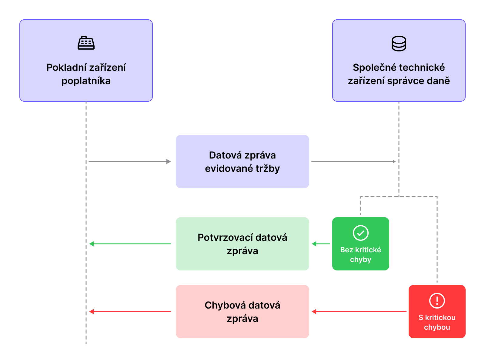
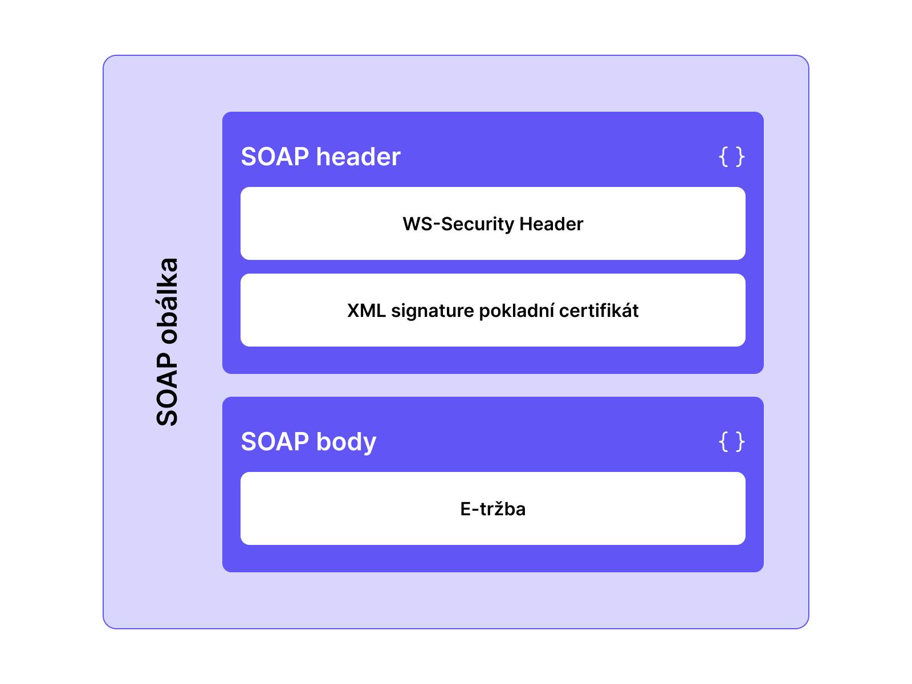
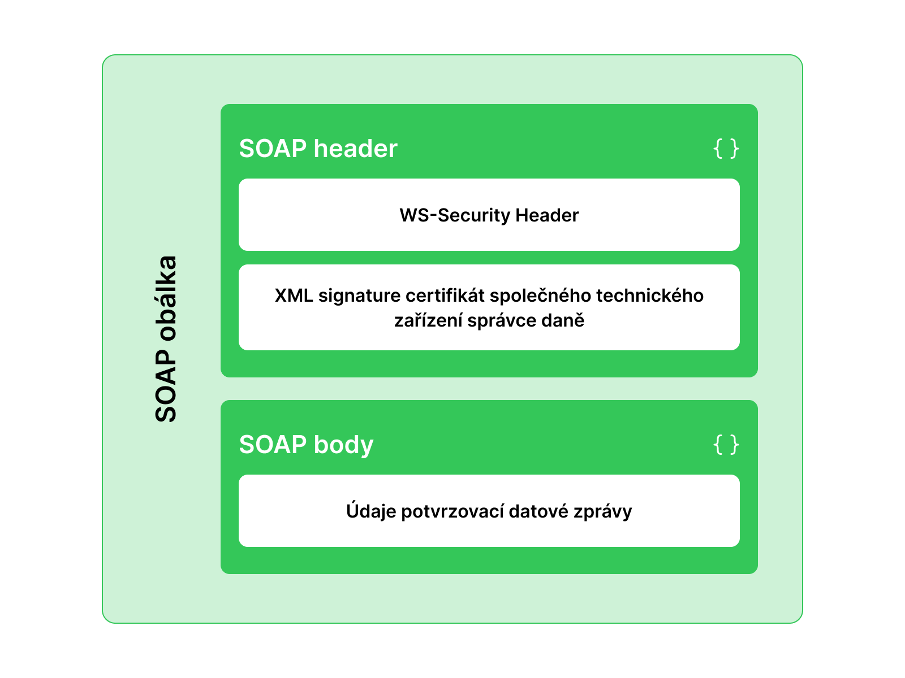
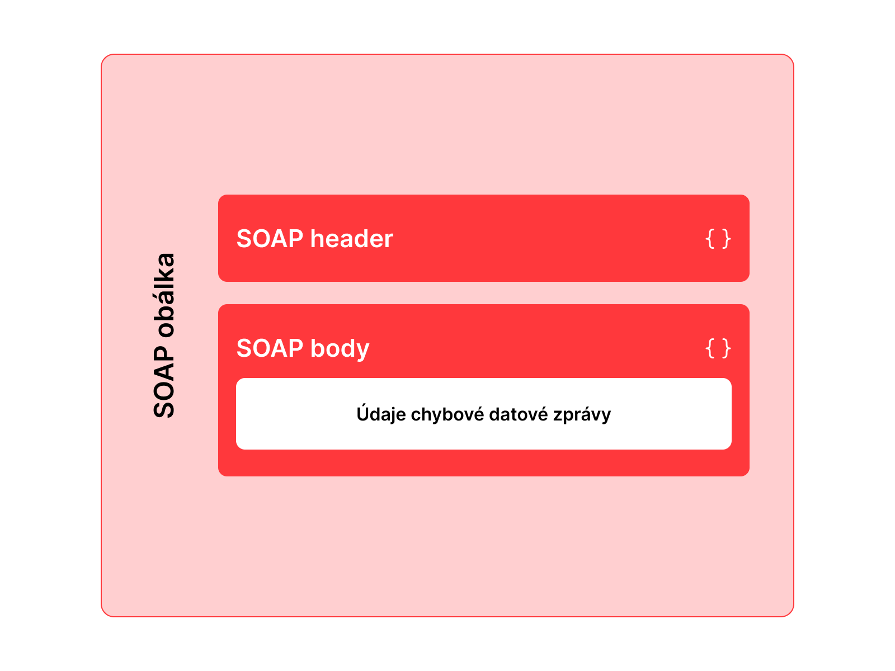
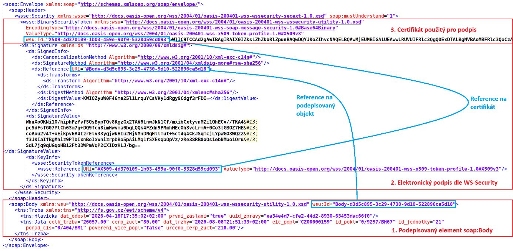

# Elektronická evidence tržeb 2.0

*Formát a struktura údajů o evidované tržbě a popis datového rozhraní pro příjem datových zpráv evidovaných tržeb*

| Položka | Hodnota |
|---|---|
| Verze | 1.1 |
| Datum poslední verze dokumentu | 20. 07. 2026 |

## Změny vůči publikované verzi 1.0

| Změna | Popis |
|---:|---|
| 1 | 02. 06. 2026 — Uvolnění verze 1.0 |
| 2 | 07. 07. 2026 — Verze 1.1: upřesnění pravidel pro deklaraci UTF-8 kódování zpráv (použití hlavičky `Content-Type`) |

> Tabulka změn nepopisuje drobné formální úpravy textu.

## Vymezení obsahu dokumentu

Dokument popisuje datové rozhraní pro příjem a potvrzování datových zpráv obsahujících údaje o tržbě, které jsou poplatníci EET povinni zasílat pro každou uskutečněnou tržbu, která je předmětem evidence dle zákona o evidenci tržeb a o změně některých dalších zákonů (verze 1.0 tohoto dokumentu vychází ze znění vládního návrhu zákona rozeslaného poslancům dne 11. 5. 2026 jako sněmovní tisk č. 189/0).

Soubory obsahující definici XML schematu a webové služby (WSDL), které formálně popisují strukturu datových zpráv evidovaných tržeb a webovou službu pro jejich příjem, jsou přílohou tohoto dokumentu.

## Obsah

1. [Úvodní informace](#1-úvodní-informace)
2. [Komunikační scénář zasílání datových zpráv](#2-komunikační-scénář-zasílání-datových-zpráv)
3. [Struktura datových zpráv](#3-struktura-datových-zpráv)
4. [Jednoznačný kód tržby – určení unikátnosti dané tržby](#4-jednoznačný-kód-tržby--určení-unikátnosti-dané-tržby)
5. [Upřesnění XML zprávy ve tvaru SOAP a její zabezpečení](#5-upřesnění-xml-zprávy-ve-tvaru-soap-a-její-zabezpečení)

## 1 Úvodní informace

Datové zprávy evidované tržby jsou zasílány jako SOAP zprávy prostřednictvím protokolu HTTPS. Zprávy jsou zabezpečené elektronickým podpisem dle standardu WS-Security. Kvůli jednoduchosti a interoperabilitě, a také pro zajištění kompatibility s předchozím řešením, jsou použity tyto standardy:

- SOAP 1.1
- WS-Security 1.1

### 1.1 Číslování verzí rozhraní

Rozhraní pro příjem datových zpráv evidovaných tržeb je po technické stránce předepsáno soubory WSDL a XSD. Rozhraní je číslováno dvojicí čísel: hlavní (první) a vedlejší (druhé), např. 1.0, 1.1, 1.2 atd. Hlavní číslo verze rozhraní je součástí URL adresy ve všech cílových prostředích (např. `v4` pro verzi 4.x). Změny v rozhraní jsou zveřejňovány následovně:

1. U drobných změn, které nemají mít vliv na implementaci v pokladních zařízeních poplatníků (kompatibilní změny), se změní pouze vedlejší číslo verze: `4.1 → 4.2 → 4.3 → …`. Verze XML schématu a WSDL v jejich hlavičce se analogicky změní z 4.1 na 4.2, 4.3 atd. URL jmenných prostorů, cílová URL služby apod. uvnitř XML schématu a WSDL se nezmění; na konci zůstane `/v4`.
2. U změn struktury datových zpráv, které vyžadují změnu implementace v pokladních zařízeních poplatníků (nekompatibilní změny, změny formátu datových položek apod.), se změní hlavní číslo verze, například `4.2 → 5.1`. Následné drobné změny budou opět číslovány `5.2`, `5.3` atd. URL jmenných prostorů, cílová URL služby apod. se změní na `/v5`.

Ke dni vydání první verze tohoto dokumentu je verze rozhraní EET 4.1 (předchozí systém EET měl poslední verzi rozhraní 3.1 a změny, které přineslo EET v roce 2026, jsou nekompatibilní).

### 1.2 Přehled zkratek

| Zkratka | Definice |
|---|---|
| CA | Certifikační autorita |
| CRL | Certificate Revocation List |
| EIČ | Evidenční identifikační číslo |
| DŘ | Daňový řád |
| EET | Elektronická evidence tržeb |
| FS, FSČR | Finanční správa České republiky |
| GFŘ | Generální finanční ředitelství |
| POK | Potvrzovací kód vracený společným technickým zařízením správce daně v případě úspěšného přijetí datové zprávy evidované tržby |
| SEČ | Středoevropský čas (CET) |
| SELČ | Středoevropský letní čas (CEST) |
| SOAP | Protokol pro výměnu zpráv založených na XML dle specifikace <https://www.w3.org/TR/soap/> |
| UUID | Unikátní identifikátor dle standardu RFC 9562 Universally Unique IDentifiers (UUIDs) |
| WS-Security | Web Services Security – rozšíření SOAP standardu o zabezpečení WWW služeb dle specifikace publikované <http://www.oasis-open.org/committees/wss/> |
| WSDL | Web Services Description Language – jazyk založený na XML určený pro popis funkcí, jež nabízí WWW služba, dle specifikace <https://www.w3.org/TR/wsdl> |
| XML Schema | Jazyk založený na XML, určený pro definici struktury XML dokumentů, dle specifikace <https://www.w3.org/TR/xmlschema11-1/> a <https://www.w3.org/TR/xmlschema11-2/> |
| XSD | Popis struktury XML dokumentu pomocí XML Schema (XML Schema Definition) |
| ZoET | Zákon o evidenci tržeb a o změně některých dalších zákonů |

### 1.3 Přehled základních pojmů

| Pojem | Definice |
|---|---|
| e-tržba | Datová struktura v zákonem definovaném formátu, která obsahuje všechny datové údaje evidované tržby tak, jak je stanoví ZoET. |
| Datová zpráva evidované tržby | Datová struktura v zákonem požadovaném XML formátu, která obsahuje e-tržbu a další potřebné údaje technického charakteru. Jedná se o kompletní XML zprávu obsahující údaje popsané příslušnými standardy pro webové služby: SOAP/WSDL/WS-Security atd. Pokladní zařízení ji zasílá na společné technické zařízení správce daně. Každé evidované tržbě odpovídá právě jedna datová zpráva evidované tržby, nejde-li o opakované zaslání téže tržby. |
| Potvrzovací datová zpráva | Datová struktura v zákonem definovaném tvaru dle tohoto dokumentu, která obsahuje potvrzovací kód (POK) a současně slouží jako potvrzení přijetí a formální správnosti[^1] zaslané datové zprávy evidované tržby. |
| Chybová datová zpráva | Datová struktura v zákonem definovaném tvaru dle tohoto dokumentu, která obsahuje chybový kód a jeho případný slovní popis pro případ, že přijatá datová zpráva obsahuje kritické chyby znemožňující její zpracování, došlo k jiné chybě znemožňující další zpracování na straně správce daně, nebo byla datová zpráva bez kritických chyb zaslána v ověřovacím módu. |
| Pokladní zařízení poplatníka | Zařízení na straně poplatníka, které zasílá údaje o evidované tržbě. Dle kontextu jím může být samotné koncové zařízení (například pokladna) i následný SW a HW, který datové zprávy skutečně zasílá. Položka „Označení pokladního zařízení“ identifikuje koncové zařízení (pokladnu); jinde v textu se většinou míní koncové zařízení i následný SW a HW zasílající datovou zprávu. |
| Evidovaná tržba | Platba splňující formální náležitosti evidované tržby a zakládající rozhodný příjem. Evidovanou tržbou je také platba splňující formální náležitosti evidované tržby, určená k následnému čerpání nebo zúčtování, které zakládají rozhodný příjem, nebo následné čerpání či zúčtování takové platby. |
| Systém EET | Informační systém sestávající ze společného technického zařízení správce daně pro přijímání datových zpráv obsahujících údaje o evidované tržbě a z částí zajišťujících návazné zpracování dat EET. |

[^1]: Formální správností datové zprávy se rozumí shoda s předepsanou datovou strukturou a splnění veřejně dokumentovaných kritických kontrol, které jsou podmínkou přijetí datové zprávy evidované tržby, nikoliv věcná správnost údajů o příslušné evidované tržbě.

## 2 Komunikační scénář zasílání datových zpráv

### 2.1 Základní schéma komunikace

Pokladní zařízení zasílá jednotlivé datové zprávy evidovaných tržeb na společné technické zařízení správce daně určené správcem daně. Vyhoví-li datová zpráva evidované tržby kritickým kontrolám (viz [2.2.3](#223-kritické-kontroly-kritické-chyby)) a lze-li ji na straně finanční správy uložit, společné technické zařízení správce daně bezprostředně vytvoří potvrzovací datovou zprávu a odešle ji zpět pokladnímu zařízení, které zprávu odeslalo.

Komunikace probíhá v režimu požadavek/odpověď (*request/response*). Potvrzovací datová zpráva potvrzuje přijetí a formální správnost přijaté datové zprávy. Je vracena jako synchronní odpověď a s původní datovou zprávou je svázána UUID přiděleným poplatníkem. Obsahuje potvrzovací kód (POK), generovaný společným technickým zařízením správce daně; POK je pro každou správně přijatou datovou zprávu unikátní.

Pokud datová zpráva nevyhoví kritickým kontrolám nebo dojde k technické chybě na straně společného technického zařízení správce daně, která znemožní další zpracování, je pokladní zařízení informováno chybovou datovou zprávou, umožní-li to povaha chyby. Vedle ostrého módu existuje ověřovací mód, v němž se pouze ověřuje zpracovatelnost zprávy, ale zpráva není přijata jako datová zpráva evidované tržby.



### 2.2 Módy odesílání datových zpráv, produkční a neprodukční prostředí

#### 2.2.1 Mód odeslání datové zprávy

Poplatník EET může odeslat datovou zprávu s údaji o evidované tržbě v jednom ze dvou módů. Požadovaný mód zvolí příznakem ověřovacího módu odesílání (atribut `overeni`) v hlavičce datové zprávy:

- **Ostrý mód** slouží pro běžné odesílání datových zpráv s údaji o evidované tržbě (standardní plnění evidenční povinnosti podle ZoET) a získání POK. Hlavička zprávy příznak ověřovacího módu neobsahuje nebo jej má nastaven na `false`.
- **Ověřovací mód** slouží k ověření správného nastavení a funkčnosti spojení pokladního zařízení se systémem EET. Datová zpráva musí obsahovat příznak ověřovacího módu s hodnotou `true`. Jejím zasláním není splněna povinnost zaslat údaje o evidované tržbě ve smyslu ZoET.

#### 2.2.2 Produkční a neprodukční prostředí

GFŘ zveřejní adresy webové služby v produkčním prostředí a v jednom nebo více neprodukčních prostředích systému EET:

- **Produkční prostředí** je určeno pro poplatníky EET a slouží pro rutinní provoz, zejména příjem a potvrzování datových zpráv s údaji o evidovaných tržbách. Certifikáty pro evidenci tržeb (pokladní certifikáty a certifikáty společného technického zařízení správce daně) použité v produkčním prostředí se nazývají „produkční certifikáty“.
- **Neprodukční prostředí (playground)** slouží výhradně vývojářům softwaru pro pokladní zařízení, nikoliv koncovým uživatelům. Zasláním datové zprávy do neprodukčního prostředí není splněna povinnost zaslat údaje o evidované tržbě; POK vrácený neprodukčním prostředím není platným potvrzovacím kódem. Certifikáty zde mohou být vydávány zjednodušeným způsobem a označují se jako „testovací certifikáty“.

S oběma prostředími lze komunikovat v ostrém i ověřovacím módu. Odpověď závisí na módu (hodnotě `overeni` v elementu `Hlavicka`), cílovém prostředí (adrese webové služby) a validitě zprávy (výskytu kritických chyb).

| Mód | Prostředí | Validita | Odpověď systému EET |
|---|---|---|---|
| Ostrý (`overeni` chybí / `false`) | Produkční | Validní | Potvrzovací zpráva s POK a případnými varováními; POK je unikátní a platný; odpověď je podepsána produkčním certifikátem; tržba je přijata, zaevidována a bude uchovávána systémem EET. |
| Ostrý | Produkční | Nevalidní | Chybová zpráva s nenulovým kódem a textovým popisem chyby; bez elektronického podpisu. |
| Ostrý | Neprodukční (playground) | Validní | Potvrzovací zpráva s POK a případnými varováními; POK končí `-ff` a není platný; odpověď obsahuje `test="true"` a je podepsána testovacím certifikátem. |
| Ostrý | Neprodukční (playground) | Nevalidní | Chybová zpráva s nenulovým kódem a textem chyby; odpověď obsahuje `test="true"`; bez elektronického podpisu. |
| Ověřovací (`overeni="true"`) | Produkční | Validní | Chybová zpráva s kódem `0` a případnými varováními; popis: `Datovou zpravu evidovane trzby v overovacim modu se podarilo zpracovat`; bez elektronického podpisu. |
| Ověřovací | Produkční | Nevalidní | Chybová zpráva s nenulovým kódem a textem chyby; bez elektronického podpisu. |
| Ověřovací | Neprodukční (playground) | Validní | Chybová zpráva s kódem `0` a případnými varováními; stejný popis jako výše; obsahuje `test="true"`; bez elektronického podpisu. |
| Ověřovací | Neprodukční (playground) | Nevalidní | Chybová zpráva s nenulovým kódem a textem chyby; obsahuje `test="true"`; bez elektronického podpisu. |

> Ve všech ostatních případech této tabulky byla evidovaná tržba přijata systémem EET, ale nebude zaevidována ani dále uchovávána systémem EET.

#### 2.2.3 Kritické kontroly (kritické chyby)

Systém EET provádí na přijatých datových zprávách evidovaných tržeb kritické kontroly. Pokud kterákoli z nich neprojde, zpráva nebude přijata a POK nebude vydán. Systém při kritické chybě vrací chybovou datovou zprávu s číselným kódem a textovým popisem (viz [3.5.4](#354-seznam-chybových-kódů-a-chybových-zpráv)). Podle povahy chyby se zpracování může zastavit již při první kritické chybě. Mezi chybové stavy patří i technické poruchy zpracování. Při chybách, které může systém vyhodnotit jako kybernetický útok, klientovi žádnou odpověď neposílá.

1. Kontrola kódování XML dokumentu — předepsáno je UTF-8.
2. Kontrola vůči konkrétnímu XML schematu (`*.xsd`) datové zprávy evidované tržby, včetně definice struktury, formátů položek a přítomnosti povinných položek.
3. Kontrola elektronického podpisu datové zprávy (certifikát poplatníka je součástí SOAP obálky dle WS-Security): kontrola vydavatele pokladního certifikátu, jeho platnosti včetně dostupných CRL a kryptografická kontrola podpisu vůči pokladnímu certifikátu.
4. Kontrola integrity EIČ poplatníka.
5. Kontrola celkové délky datové zprávy včetně SOAP obálky; nesmí přesáhnout 12 kB.

#### 2.2.4 Propustné kontroly (propustné chyby)

Propustné kontroly nejsou důvodem k odmítnutí POK. Jejich výsledek se pouze uloží do úložiště datových zpráv pro případné další zpracování:

1. Shodnost EIČ poplatníka v elementu `Trzba` s EIČ v certifikátu použitým k podpisu zprávy.
2. Integrita EIČ pověřujícího poplatníka, je-li uvedeno.
3. EIČ poplatníka musí být různé od EIČ pověřujícího poplatníka, je-li uvedeno.
4. Kontrola data a času uskutečnění tržby proti času přijetí zprávy. Chybné je datum o více než 2 hodiny novější, o více než 2 roky starší nebo starší než minimální okamžik pro příslušné cílové prostředí:
    - neprodukční prostředí (playground), verze 4: 01. 07. 2026;
    - produkční prostředí před 01. 01. 2027: 01. 11. 2026;
    - produkční prostředí: 01. 01. 2027.
5. Kontrola čísla evidenční jednotky: musí odpovídat tvaru čísel přidělovaných v DIS+ na portálu MOJE Daně (alespoň dvě dekadické cifry, poslední pozice jedna z hodnot 1, 2, 3 nebo 4).

Pokud propustná kontrola neprojde a nenastane kritická chyba, datová zpráva bude přijata a POK vydán. Potvrzovací zpráva se doplní o textová varování a odpovídající číselné kódy; stejně se varování zařazují do chybové odpovědi s kódem `0` v ověřovacím módu.

### 2.3 Standardy síťové komunikace

#### 2.3.1 HTTPS/TLS

Použití HTTPS je povinné, bez autentizace klientskými certifikáty. Podporované verze TLS jsou TLS 1.2 a vyšší.

#### 2.3.2 HTTP

Použití protokolu HTTP/1.1 je povinné.

### 2.4 Certifikáty

Certifikáty pro zabezpečení HTTPS spojení, pro podpis datových zpráv evidované tržby a potvrzovacích datových zpráv popisuje dokument „Přístupové a provozní informace“ příslušný pro dané prostředí.

## 3 Struktura datových zpráv

### 3.1 Kódování datových položek

Všechny položky ve všech datových zprávách používají pouze vybrané znaky kódované jedním bajtem ve standardní ASCII znakové sadě. Dekadické kódy povolených znaků jsou 9, 10, 13 nebo 32 až 126.

Kódování datových zpráv jako XML dokumentů je povinně UTF-8. Klient musí správně deklarovat `Content-Type` v HTTP hlavičce:

```http
Content-Type: text/xml; charset=utf-8
```

Není-li tento `Content-Type` uveden, první řádek XML SOAP obálky musí mít vždy tvar:

```xml
<?xml version="1.0" encoding="UTF-8"?>
```

Všechny XML elementy e-tržby patří do jmenného prostoru specifikovaného ve WSDL, například:

```xml
xmlns:tns="http://fs.gov.cz/eet/schema/v4"
```

Maska datového formátu jednotlivých položek znamená regulární výraz ve smyslu XML Schema, který přesně definuje požadovanou syntaxi. Pro jednoznačnost dokument uvádí metaznak pro začátek řetězce (`^`) a konec řetězce (`$`). Hexadecimální číslice `a` až `f` lze uvádět malými nebo velkými písmeny.

### 3.2 Přehled struktury datových zpráv

Všechny tři druhy datových zpráv (datová zpráva evidované tržby, potvrzovací datová zpráva a chybová datová zpráva) mají společný základní formát daný SOAP; aplikační XML datové struktury jsou vloženy do těla SOAP obálky (`<SOAP Body>`). Datová zpráva evidované tržby a potvrzovací datová zpráva jsou elektronicky podepsány, chybová datová zpráva nikoliv.







### 3.3 Datová zpráva evidované tržby

Datová zpráva včetně SOAP obálky je SOAP XML struktura obsahující všechny údaje stanovené pro odeslání údajů o evidované tržbě. Vlastní data jsou uložena ve vnořené struktuře e-tržby (element `<Trzba>`) v elementu `<SOAP Body>`.

V elementu `<SOAP Header>` je XML podpis a pokladní certifikát, k němuž byl použit příslušný privátní klíč. Pokud certifikát klíče použitý v době přijetí tržby již není v okamžiku odesílání platný, poplatník pro XML podpis použije aktuálně platný certifikát.

Datová zpráva je formálně popsána v definici příslušné webové služby (viz [kapitola 5](#5-upřesnění-xml-zprávy-ve-tvaru-soap-a-její-zabezpečení)). Element `<Trzba>` obsahuje dvě vnořené datové oblasti: `<Hlavicka>` a `<Data>`.

#### 3.3.1 XML formát e-tržby

```xml
<tns:Trzba>
    <tns:Hlavicka atributy … />
    <tns:Data atributy … />
</tns:Trzba>
```

#### 3.3.2 Přehled položek datové zprávy o evidované tržbě

| Datová oblast | # | Název položky | Povinná | XML jméno |
|---|---:|---|---|---|
| Hlavička | 1 | UUID zprávy | Ano | `uuid_zpravy` |
| Hlavička | 2 | Datum a čas odeslání zprávy | Ano | `dat_odesl` |
| Hlavička | 3 | První zaslání údajů o tržbě | Ano | `prvni_zaslani` |
| Hlavička | 4 | Příznak ověřovacího módu odesílání | Ne | `overeni` |
| Data | 5 | EIČ poplatníka | Ano | `eic_popl` |
| Data | 6 | EIČ pověřujícího poplatníka | Ne | `eic_poverujiciho` |
| Data | 7 | Pověření více poplatníky | Ne | `povereni_vice_popl` |
| Data | 8 | Označení evidenční jednotky | Ano | `id_jednotky` |
| Data | 9 | Označení pokladního zařízení poplatníka | Ano | `id_pokl` |
| Data | 10 | Pořadové číslo tržby | Ano | `porad_cis` |
| Data | 11 | Datum a čas uskutečnění tržby | Ano | `dat_trzby` |
| Data | 12 | Celková částka tržby | Ano | `celk_trzba` |
| Data | 13 | Celková částka plateb určená k následnému čerpání nebo zúčtování | Ne | `urceno_cerp_zuct` |
| Data | 14 | Celková částka plateb, které jsou následným čerpáním nebo zúčtováním platby | Ne | `cerp_zuct` |

„XML jméno“ znamená jméno XML elementu nebo XML atributu. Povinné položky musí být vyplněny v každé zprávě. Nepovinné položky musí být vyplněny, jsou-li pro evidovanou tržbu relevantní (např. je-li poplatník pověřen evidencí tržeb jiného poplatníka, vyplní EIČ pověřujícího poplatníka). Nejsou-li uvedeny, považují se za prázdné. Položky s prázdnou hodnotou jsou v XML zprávě nepřípustné, například:

```xml
eic_poverujiciho=""
```

#### 3.3.3 Podrobný popis položek e-tržby

Tato kapitola popisuje technický formát a strukturu položek e-tržby. Další informace k věcnému obsahu budou v dokumentu „Popis položek datové zprávy a příklady situací při evidenci tržeb“. Příklady dále používají EIČ `CZ00000019`, `CZ683555118` a `CZ8551015704`.

##### 3.3.3.1 UUID zprávy (`uuid_zpravy`)

Je atributem `<Hlavicka>`. UUID datové zprávy generuje pokladní zařízení a má mít formát dle RFC 9562:

```text
xxxxxxxx-xxxx-Mxxx-Nxxx-xxxxxxxxxxxx
```

`x`, `M` a `N` jsou hexadecimální číslice. `M` vyjadřuje verzi UUID a smí nabývat hodnot 1 až 5; doporučená verze je 4. UUID jednoznačně identifikuje datovou zprávu, nikoli e-tržbu; i při opakovaném zaslání téže tržby má být vytvořeno nové UUID. Dva nejvyšší bity číslice `N` jsou povinně `10`, proto smí `N` nabýt hodnot `8`, `9`, `A` nebo `B`.

```text
^[0-9a-fA-F]{8}-[0-9a-fA-F]{4}-[1-5][0-9a-fA-F]{3}-[89abAB][0-9a-fA-F]{3}-[0-9a-fA-F]{12}$
```

Délka: 36 znaků. Příklad: `b3a09b52-7c87-4014-a496-4c7a53cf9125`. Znak `-` je pomlčka (ASCII 45).

##### 3.3.3.2 Datum a čas odeslání zprávy (`dat_odesl`)

Je atributem `<Hlavicka>` a znamená okamžik, kdy pokladní zařízení zprávu odeslalo. Formát `DateTime` dle ISO 8601 a [W3C XML Schema](https://www.w3.org/TR/xmlschema11-2/#dateTime):

```text
rrrr-mm-ddThh:mm:ss±hh:mm
```

`rrrr-mm-dd` je datum, `hh:mm:ss` čas a `±hh:mm` časová zóna vůči UTC/GMT. Znak `±` je `+` nebo `-`; speciální `Z` znamená `+00:00`. Datum a čas se uvádí jako lokální čas s povinnou časovou zónou:

- `+01:00`, spadá-li hodnota do zimního času v ČR (SEČ);
- `+02:00`, spadá-li do letního času v ČR (SELČ);
- `+hh:mm`, `-hh:mm` nebo `Z`, je-li uvedena jiná časová zóna.

Délka: 25 znaků. Příklady: `2027-01-09T04:25:28+01:00` (04:25:28 SEČ, tedy 03:25:28 UTC/GMT) a `2027-06-09T05:25:28+02:00` (05:25:28 SELČ, tedy 03:25:28 UTC/GMT).

##### 3.3.3.3 První zaslání údajů o tržbě (`prvni_zaslani`)

Je atributem `<Hlavicka>`. Příznak `true`/`1` určuje první zaslání konkrétní evidované tržby; `false`/`0` opakované zaslání téže tržby. Datový formát určuje [W3C boolean](https://www.w3.org/TR/xmlschema11-2/#boolean). Délka: 1 až 5 znaků. Příklad: `true`.

##### 3.3.3.4 Příznak ověřovacího módu odesílání (`overeni`)

Je nepovinným atributem `<Hlavicka>`. Je-li uveden s hodnotou `true`/`1`, zpráva se zpracuje v ověřovacím módu (viz [2.2](#22-módy-odesílání-datových-zpráv-produkční-a-neprodukční-prostředí)). Není-li uveden nebo má hodnotu `false`/`0`, zpráva se zpracuje v ostrém módu. Formát určuje [W3C boolean](https://www.w3.org/TR/xmlschema11-2/#boolean), délka je 1 až 5 znaků. Příklad: `true`.

##### 3.3.3.5 EIČ poplatníka (`eic_popl`)

Je atributem `<Data>`. Jde o platné EIČ poplatníka odesílajícího zprávu, platné k okamžiku uskutečnění tržby nebo vydání příkazu k jejímu provedení, byl-li vydán dříve. Povinnou součástí EIČ je kód státu `CZ`. Hodnota atributu se shoduje s EIČ v certifikátu použitém k elektronickému podpisu. Poplatník, kterému bylo EIČ změněno, může do vystavení nového certifikátu odesílat zprávy s novým EIČ v `eic_popl`, podepsané původním certifikátem.

```text
^CZ[0-9]{8,10}$
```

Délka: 10 až 12 znaků. Příklady: `CZ00000019`, `CZ683555118`, `CZ8551015704`.

##### 3.3.3.6 EIČ pověřujícího poplatníka (`eic_poverujiciho`)

Je nepovinným atributem `<Data>`. Je to platné EIČ poplatníka, kterému tržba plyne a který pověřil jiného poplatníka, aby tržbu evidoval. Datový formát je stejný jako pro EIČ poplatníka.

##### 3.3.3.7 Pověření více poplatníky (`povereni_vice_popl`)

Je nepovinným atributem `<Data>`. Příznak `true`/`1` nebo `false`/`0` určuje, zda je tržba evidována v pověření za více poplatníků, jimž tržba plyne (např. ve sdružení bez právní subjektivity nebo spoluvlastnictví). Není-li uveden, má stejný význam jako `false`/`0`. Formát určuje [W3C boolean](https://www.w3.org/TR/xmlschema11-2/#boolean), délka: 1 až 5 znaků. Příklad: `true`.

##### 3.3.3.8 Označení evidenční jednotky (`id_jednotky`)

Je atributem `<Data>`. Jde o číselné označení evidenční jednotky přidělené poplatníkovi v DIS+ na portálu MOJE Daně; je unikátní v rámci poplatníka. Čísla obvykle mají alespoň dvě dekadická místa a poslední cifru 1, 2, 3 nebo 4.

```text
^[1-9][0-9]{0,8}$
```

Délka: 1 až 9 znaků, rozsah 1 až 999 999 999. Příklady: `24`, `164968741`.

##### 3.3.3.9 Označení pokladního zařízení poplatníka (`id_pokl`)

Je atributem `<Data>`. Identifikační kód zařízení, které zasílá zprávu na společné technické zařízení správce daně. Kód vytváří poplatník z alfanumerických a vybraných speciálních znaků a musí být pro daného poplatníka unikátní v jedné evidenční jednotce v jednom okamžiku. Unikátní musí být čtveřice `(eic_popl, id_jednotky, id_pokl, dat_trzby)`.

```text
^[0-9a-zA-Z\.,:;/#\-_ ]{1,20}$
```

Délka: 1 až 20 znaků. Posledním znakem ve třídě je mezera (ASCII 32); `-` je pomlčka (ASCII 45). Příklad: `5a/A-q/5:22d_2`.

##### 3.3.3.10 Pořadové číslo tržby (`porad_cis`)

Je atributem `<Data>`. Jde o pořadové číslo tržby, které vytváří poplatník z alfanumerických a vybraných speciálních znaků. Musí být pro konkrétního poplatníka unikátní v jedné evidenční jednotce, pro jedno pokladní zařízení v jednom okamžiku; unikátní musí být pětice `(eic_popl, id_jednotky, id_pokl, porad_cis, dat_trzby)`. Typicky jde o číslo účtenky k danému plnění.

```text
^[0-9a-zA-Z\.,:;/#\-_ ]{1,25}$
```

Délka: 1 až 25 znaků. Posledním znakem ve třídě je mezera (ASCII 32); `-` je pomlčka (ASCII 45). Příklad: `#25/c-12/1A_2/2027`.

##### 3.3.3.11 Datum a čas uskutečnění tržby (`dat_trzby`)

Je atributem `<Data>`. Jde o datum a čas přijetí evidované tržby nebo vydání příkazu k jejímu provedení, byl-li vydán dříve. Formát je shodný s `dat_odesl` (viz [3.3.3.2](#3332-datum-a-čas-odeslání-zprávy-dat_odesl)): uvádí se lokální časová zóna uskutečnění tržby a povinně jednoznačné určení této časové zóny.

##### 3.3.3.12 Finanční položky tržby

Všechny jsou atributy `<Data>` a představují finanční hodnoty v Kč:

| # | Položka | XML jméno |
|---:|---|---|
| 12 | Celková částka tržby | `celk_trzba` |
| 13 | Celková částka plateb určená k následnému čerpání nebo zúčtování | `urceno_cerp_zuct` |
| 14 | Celková částka plateb, které jsou následným čerpáním nebo zúčtováním platby | `cerp_zuct` |

Částky jsou v dekadické soustavě s právě dvěma povinnými desetinnými místy a řádovou tečkou dle [W3C decimal](https://www.w3.org/TR/xmlschema11-2/#decimal). Mohou být kladné, nulové nebo záporné. Jsou zakázány číselně nevýznamné vedoucí nuly a znak minus před nulou. Neobsažené nebo nevyplněné finanční položky jsou prázdné (nedefinované), nikoli nulové; prázdné hodnoty jsou v XML nepřípustné.

```text
^((0|-?[1-9]\d{0,7})\.\d\d|-0\.(0[1-9]|[1-9]\d))$
```

Délka a rozsah:

- nezáporné hodnoty: 4 až 11 znaků, od `0.00` do `99999999.99` Kč;
- záporné hodnoty: 5 až 12 znaků, od `-99999999.99` do `-0.01` Kč.

Absolutní hodnota je tedy menší než 100 milionů Kč. Příklady: `250.00`, `-187.20`, `0.56`.

| Číselná hodnota | Chybná reprezentace | Správná reprezentace |
|---:|---|---|
| 20,45 | `020.45` | `20.45` |
| 10,25 | `00010.25` | `10.25` |
| 0 | `-0.00` | `0.00` |
| 0 | `-00.00` | `0.00` |
| 0,2 | `.20` | `0.20` |
| -100 | `-00100.00` | `-100.00` |

#### 3.3.4 Příklad e-tržby

Příklad XML elementu `<Trzba>` zasílaného v běžném produkčním módu:

```xml
<tns:Trzba>
    <tns:Hlavicka
        uuid_zpravy="e23e5a5a-08d7-4a08-844d-2b6c6b60621d"
        dat_odesl="2027-01-08T21:19:40+01:00"
        prvni_zaslani="true" />
    <tns:Data eic_popl="CZ8551015704" eic_poverujiciho="CZ00000019"
        povereni_vice_popl="true" id_jednotky="181" id_pokl="00/2535/CN58"
        porad_cis="0/2482/IE25" dat_trzby="2027-01-07T22:01:00+01:00"
        celk_trzba="87988.00" urceno_cerp_zuct="343.00"
        cerp_zuct="237.00" />
</tns:Trzba>
```

Příklad v ověřovacím módu:

```xml
<tns:Trzba>
    <tns:Hlavicka
        uuid_zpravy="e23e5a5a-08d7-4a08-844d-2b6c6b60621d"
        dat_odesl="2027-01-08T21:19:40+01:00"
        prvni_zaslani="true" overeni="true" />
    <tns:Data eic_popl="CZ8551015704" eic_poverujiciho="CZ00000019"
        povereni_vice_popl="true" id_jednotky="181" id_pokl="00/2535/CN58"
        porad_cis="0/2482/IE25" dat_trzby="2027-01-07T22:01:00+01:00"
        celk_trzba="87988.00" urceno_cerp_zuct="343.00"
        cerp_zuct="237.00" />
</tns:Trzba>
```

### 3.4 Potvrzovací datová zpráva

Potvrzovací datová zpráva je SOAP XML struktura s potvrzovacími údaji o přijetí evidované tržby společným technickým zařízením správce daně. Potvrzovací data jsou v `<SOAP Body>`. `<SOAP Header>` obsahuje XML podpis a certifikát společného technického zařízení správce daně, k němuž byl použit příslušný privátní klíč.

Vlastní potvrzení je v `<SOAP Body>` jako `<Odpoved>`, které obsahuje oblasti `<Hlavicka>` a `<Potvrzeni>`. Varianty odpovědí popisuje tabulka v [2.2.2](#222-produkční-a-neprodukční-prostředí). Nastane-li propustná chyba, zpráva obsahuje také textová varování a jejich číselné kódy.

#### 3.4.1 XML formát potvrzení

```xml
<tns:Odpoved>
    <tns:Hlavicka atributy … />
    <tns:Potvrzeni atributy … />
    <tns:Varovani atributy ...>
        hodnoty ...
    </tns:Varovani>
    ...
</tns:Odpoved>
```

Nepovinný element `<Varovani>` lze pro různá varování uvést vícekrát.

#### 3.4.2 Přehled datových položek potvrzení

| Datová oblast | # | Název položky | Povinná | XML jméno |
|---|---:|---|---|---|
| Hlavička | 1 | UUID zprávy | Ano | `uuid_zpravy` |
| Hlavička | 2 | Datum a čas přijetí zprávy | Ano | `dat_prij` |
| Potvrzeni | 3 | Potvrzovací kód | Ano | `pok` |
| Potvrzeni | 4 | Příznak neprodukčního prostředí | Ne | `test` |
| Varování | 5 | Kód varování | Ne | `kod_varov` |
| Varování | 6 | Textový popis varování | Ne | `Varovani` |

„XML jméno“ znamená jméno elementu nebo atributu. Element `<Varovani>` s atributem `kod_varov` se může v potvrzovací zprávě opakovat.

##### 3.4.2.1 UUID zprávy (`uuid_zpravy`)

Atribut `<Hlavicka>`; UUID datové zprávy evidované tržby zaslané pokladním zařízením. Viz [3.3.3.1](#3331-uuid-zprávy-uuid_zpravy).

##### 3.4.2.2 Datum a čas přijetí zprávy (`dat_prij`)

Atribut `<Hlavicka>`; okamžik přijetí potvrzované datové zprávy společným technickým zařízením. Formát je shodný s `dat_odesl` (viz [3.3.3.2](#3332-datum-a-čas-odeslání-zprávy-dat_odesl)).

##### 3.4.2.3 Potvrzovací kód (`pok`)

Atribut `<Potvrzeni>`. Unikátní POK pro každou potvrzovanou zprávu má formát:

```text
uuid_prijem-Id_zarizeni
```

`uuid_prijem` generuje konkrétní zařízení transakčního systému EET a `Id_zarizeni` je jeho dvoumístné hexadecimální číslo.

```text
^[0-9a-fA-F]{8}-[0-9a-fA-F]{4}-4[0-9a-fA-F]{3}-[89abAB][0-9a-fA-F]{3}-[0-9a-fA-F]{12}-[0-9a-fA-F]{2}$
```

Délka: 39 znaků. Příklad: `b3a09b52-7c87-4014-a496-4c7a53cf9125-03`. POK z neprodukčního prostředí není skutečný POK dle ZoET a jeho poslední dva znaky jsou `ff` („Fiktivní Fiktivní“): `b3a09b52-7c87-4014-a496-4c7a53cf9125-ff`.

##### 3.4.2.4 Příznak neprodukčního prostředí (`test`)

Atribut `<Potvrzeni>`. Je-li uveden s hodnotou `true`/`1`, zpráva byla přijata do neprodukčního prostředí. Není-li uveden, byla přijata do produkčního prostředí. Formát určuje [W3C boolean](https://www.w3.org/TR/xmlschema11-2/#boolean); délka 1 až 5 znaků. Příklad: `true`.

##### 3.4.2.5 Kód varování (`kod_varov`)

Atribut `<Varovani>`. Kladné dekadické celé číslo o nejvýše třech cifrách, označující konkrétní varování:

```text
^[1-9]\d{0,2}$
```

Délka: 1 až 3 znaky. Příklady: `1`, `3`.

##### 3.4.2.6 Textový popis varování (`Varovani`)

Hodnota elementu `<Varovani>`. Krátce a česky bez diakritiky popisuje propustnou chybu. Povoleny jsou dolní ASCII XML znaky (dekadické kódy 9, 10, 13 nebo 32 až 126). Délka: max. 100 znaků.

#### 3.4.3 Příklad potvrzení

Produkční prostředí bez propustných chyb:

```xml
<tns:Odpoved>
    <tns:Hlavicka uuid_zpravy="123e4567-e89b-42d3-a456-426655440000"
        dat_prij="2027-03-04T18:25:21+01:00" />
    <tns:Potvrzeni pok="987a6be5-6af5-44f3-b4fc-987654321000-02" />
</tns:Odpoved>
```

Neprodukční prostředí s varováními o propustných chybách:

```xml
<tns:Odpoved>
    <tns:Hlavicka uuid_zpravy="123e4567-e89b-42d3-a456-426655440000"
        dat_prij="2027-03-04T18:25:21+01:00" />
    <tns:Potvrzeni pok="987a6be5-6af5-44f3-b4fc-987654321000-03"
        test="true" />
    <tns:Varovani kod_varov="1">
        EIC poplatnika v datove zprave se neshoduje s EIC v certifikatu
    </tns:Varovani>
    <tns:Varovani kod_varov="2">
        Chybny format EIC poverujiciho poplatnika
    </tns:Varovani>
</tns:Odpoved>
```

#### 3.4.4 Seznam kódů a textů varování

| Kód varování | Text varování | Poznámka |
|---:|---|---|
| 1 | `EIC poplatnika v datove zprave se neshoduje s EIC v certifikatu` | |
| 2 | `Chybny format EIC poverujiciho poplatnika` | |
| 3 | — | Bylo používáno před verzí datové zprávy 4. |
| 4 | `Datum a cas uskutecneni trzby je novejsi nez datum a cas prijeti zpravy` | |
| 5 | `Datum a cas uskutecneni trzby je vyrazne v minulosti` | |
| 6 | `id_jednotky neodpovida formatem pridelenemu c. evidencni jednotky` | |
| 7 | `EIC poverujiciho se shoduje s EIC poplatnika` | |
| 8–999 | — | Rezervováno pro budoucí použití. |

Texty varování jsou bez diakritiky v souladu s kódováním všech datových zpráv EET (viz [3.1](#31-kódování-datových-položek)).

### 3.5 Chybová datová zpráva

Chybová datová zpráva je SOAP XML struktura s chybovým kódem a textovým hlášením o kritické chybě přijaté datové zprávy evidované tržby nebo o dočasné technické chybě zpracování na straně společného technického zařízení správce daně, která vyžaduje odeslat zprávu později.

Její data jsou v `<SOAP Body>` jako `<Odpoved>`, s oblastmi `<Hlavicka>` a `<Chyba>`. `<SOAP Header>` neobsahuje XML podpis ani certifikát. Varianty odpovědi jsou v [2.2.2](#222-produkční-a-neprodukční-prostředí). V ověřovacím módu se do chybové zprávy s kódem `0` při propustných chybách doplňují varování stejným způsobem jako do potvrzovací zprávy.

#### 3.5.1 XML formát chyby

```xml
<tns:Odpoved>
    <tns:Hlavicka atributy … />
    <tns:Chyba atributy …>
        hodnoty …
    </tns:Chyba>
    <tns:Varovani atributy …>
        hodnoty …
    </tns:Varovani>
</tns:Odpoved>
```

#### 3.5.2 Přehled datových položek chyby

| Datová oblast | # | Název položky | Povinná | XML jméno |
|---|---:|---|---|---|
| Hlavička | 1 | UUID zprávy | Ne | `uuid_zpravy` |
| Hlavička | 2 | Datum a čas odmítnutí zprávy | Ne | `dat_odmit` |
| Chyba | 3 | Chybový kód | Ano | `kod` |
| Chyba | 4 | Textový popis chyby | Ano | `Chyba` |
| Chyba | 5 | Příznak neprodukčního prostředí | Ne | `test` |
| Varování | 6 | Kód varování | Ne | `kod_varov` |
| Varování | 7 | Textový popis varování | Ne | `Varovani` |

„XML jméno“ znamená jméno elementu nebo atributu. `<Varovani>` je v chybové zprávě relevantní pouze pro chybový kód `0` (`Datovou zpravu evidovane trzby v overovacim modu se podarilo zpracovat`) a může se opakovat.

##### 3.5.2.1 UUID zprávy (`uuid_zpravy`)

Atribut `<Hlavicka>`; UUID chybné datové zprávy evidované tržby zaslané pokladním zařízením. Viz [3.3.3.1](#3331-uuid-zprávy-uuid_zpravy).

##### 3.5.2.2 Datum a čas odmítnutí zprávy (`dat_odmit`)

Atribut `<Hlavicka>`; okamžik zpracování chybné zprávy na společném technickém zařízení správce daně. Formát je shodný s `dat_odesl` (viz [3.3.3.2](#3332-datum-a-čas-odeslání-zprávy-dat_odesl)).

##### 3.5.2.3 Chybový kód (`kod`)

Atribut `<Chyba>`. Nejvýše tříciferné dekadické celé číslo označující konkrétní kritickou chybu; může být kladné, nulové nebo záporné:

```text
^-?\d{1,3}$
```

- nezáporné hodnoty: délka 1 až 3 znaky, rozsah 0 až 999;
- záporné hodnoty: délka 2 až 4 znaky, rozsah -999 až -1.

Příklady: `10`, `-1`, `560`.

##### 3.5.2.4 Textový popis chyby (`Chyba`)

Hodnota elementu `<Chyba>`. Krátce a česky bez diakritiky popisuje chybu při zpracování datové zprávy. Povoleny jsou dolní ASCII XML znaky (dekadické kódy 9, 10, 13 nebo 32 až 126). Délka: max. 100 znaků.

##### 3.5.2.5 Příznak neprodukčního prostředí (`test`)

Atribut `<Chyba>`. Je-li uveden s hodnotou `true`/`1`, byla zpráva přijata do neprodukčního prostředí; není-li uveden, šlo o produkční prostředí. Formát určuje [W3C boolean](https://www.w3.org/TR/xmlschema11-2/#boolean), délka je 1 až 5 znaků. Příklad: `true`.

#### 3.5.3 Příklad chyby

Příklad 1 — velikost datové zprávy přesáhla dokumentovaný limit:

```xml
<tns:Odpoved>
    <tns:Hlavicka
        uuid_zpravy="123e4567-e89b-42d3-a456-426655440000"
        dat_odmit="2027-03-04T18:25:21+01:00" />
    <tns:Chyba kod="7">
        Datova zprava je prilis velka
    </tns:Chyba>
</tns:Odpoved>
```

Příklad 2 — datovou zprávu evidované tržby se nepovedlo analyzovat:

```xml
<tns:Odpoved>
    <tns:Hlavicka dat_odmit="2027-03-04T18:25:21+01:00" />
    <tns:Chyba kod="3">
        XML zprava nevyhovela kontrole XML schematu
    </tns:Chyba>
</tns:Odpoved>
```

Příklad 3 — technický problém na straně společného zařízení správce daně:

```xml
<tns:Odpoved>
    <tns:Hlavicka dat_odmit="2027-03-04T18:25:21+01:00" />
    <tns:Chyba kod="-1">
        Docasna technicka chyba zpracovani – odeslete prosim
        datovou zpravu pozdeji
    </tns:Chyba>
</tns:Odpoved>
```

Příklad neprodukčního prostředí:

```xml
<tns:Odpoved>
    <tns:Hlavicka
        uuid_zpravy="123e4567-e89b-42d3-a456-426655440000"
        dat_odmit="2027-03-04T18:25:21+01:00" />
    <tns:Chyba kod="7" test="true">
        Datova zprava je prilis velka
    </tns:Chyba>
</tns:Odpoved>
```

#### 3.5.4 Seznam chybových kódů a chybových zpráv

| Kód | Text chybové zprávy | Poznámka |
|---:|---|---|
| -999 až -2 | — | Rezervováno pro budoucí použití. |
| -1 | `Docasna technicka chyba zpracovani – odeslete prosim datovou zpravu pozdeji` | |
| 0 | `Datovou zpravu evidovane trzby v overovacim modu se podarilo zpracovat` | |
| 1 | — | Rezervováno pro budoucí použití. |
| 2 | `Kodovani XML neni platne` | |
| 3 | `XML zprava nevyhovela kontrole XML schematu` | |
| 4 | `Neplatny podpis SOAP zpravy` | |
| 5 | — | Bylo používáno před verzí datové zprávy 4. |
| 6 | `EIC poplatnika ma chybnou strukturu` | |
| 7 | `Datova zprava je prilis velka` | |
| 8 | `Datova zprava nebyla zpracovana kvuli technicke chybe nebo chybe dat` | |
| 9 až 999 | — | Rezervováno pro budoucí použití. |

Texty chyb jsou bez diakritiky v souladu s kódováním všech datových zpráv EET (viz [3.1](#31-kódování-datových-položek)). U chyby 2 lze podle situace reagovat také navrácením technické chyby, například SOAP fault, nebo ignorováním zprávy při podezření na kybernetický útok.

## 4 Jednoznačný kód tržby – určení unikátnosti dané tržby

Evidovaná tržba je jednoznačně identifikována normalizovanými (kanonizovanými) hodnotami základních datových položek elementu `<Data>`:

| Datová oblast | # | Název položky | Povinná | XML jméno |
|---|---:|---|---|---|
| Data | 5 | EIČ poplatníka | Ano | `eic_popl` |
| Data | 8 | Označení evidenční jednotky | Ano | `id_jednotky` |
| Data | 9 | Označení pokladního zařízení | Ano | `id_pokl` |
| Data | 10 | Pořadové číslo tržby | Ano | `porad_cis` |
| Data | 11 | Datum a čas uskutečnění tržby | Ano | `dat_trzby` |
| Data | 12 | Celková částka tržby | Ano | `celk_trzba` |

Přijde-li zpráva se stejnými hodnotami jako již dříve přijatá zpráva, považuje se za zaslání údajů o téže evidované tržbě. Následující zpracování pokladní zařízení provádět nemusí; slouží k vysvětlení, jak se unikátnost určuje.

Jednoznačný kombinovaný údaj je textový řetězec (*plaintext*) zřetězený z uvedených položek v tomto pořadí v ASCII, s oddělovačem `|` (ASCII 124) mezi položkami. Pokud nepovinná položka není uvedena, vstupuje jako prázdný řetězec (`""`).

| # | Název položky | XML jméno | Hodnota |
|---:|---|---|---|
| 5 | EIČ poplatníka | `eic_popl` | `CZ00000019` |
| 8 | Označení evidenční jednotky | `id_jednotky` | `243` |
| 9 | Označení pokladního zařízení | `id_pokl` | `24/A-6/Brno_2` |
| 10 | Pořadové číslo tržby | `porad_cis` | `#135433c/11/2027` |
| 11 | Datum a čas uskutečnění tržby | `dat_trzby` | `2027-01-09T16:45:36+01:00` |
| 12 | Celková částka tržby | `celk_trzba` | `3264.50` |

Výsledný plaintext:

```text
CZ00000019|243|24/A-6/Brno_2|#135433c/11/2027|2027-12-09T16:45:36+01:00|3264.50
```

## 5 Upřesnění XML zprávy ve tvaru SOAP a její zabezpečení

Rozhraní webové služby je formálně definováno WSDL. Dokument WSDL odkazuje na příslušné XML Schema, které popisuje XML strukturu e-tržby. XML struktura e-tržby je jediným obsahem elementu `<soap:Body>`. Soubory XML Schema a WSDL jsou přílohou tohoto dokumentu.

Zabezpečení webové služby se realizuje podle standardu Web Services Security (WSS) v následujících oblastech.

### 5.1 Šifrování komunikace protokolem HTTPS

Společné technické zařízení správce daně se prokazuje TLS certifikátem serveru. Pokladní zařízení musí při navázání TLS spojení (TLS handshake) zkontrolovat platnost TLS certifikátu serveru, zda jej vydala důvěryhodná autorita a zda se shoduje jméno, pro které byl vydán, s adresou společného technického zařízení. TLS autentizace klienta (pokladního zařízení) není vyžadována.

### 5.2 Podpis datových zpráv evidovaných tržeb

Každá datová zpráva evidované tržby musí být podepsána klíčem, k němuž je vydán X509 certifikát poplatníka. Certifikát musí být platný k okamžiku zpracování zprávy společným technickým zařízením správce daně.

Do elektronického podpisu SOAP zprávy se zahrne právě jeden element: `<soap:Body>` s XML strukturou e-tržby (`<tns:Trzba>`) sestavenou dle platného XSD. Podpis musí odpovídat [XML Signature Syntax and Processing (Second Edition)](https://www.w3.org/TR/xmldsig-core2/) a těmto požadavkům:

- Použije se WS-Security a XML Digital Signature.
- Digitální podpis se vloží do SOAP obálky, do sekce WS-Security hlaviček. Odkaz na podepisovaný `<soap:Body>` je relativní referencí v rámci SOAP zprávy.
- Kanonizace podepisovaného objektu používá **Exclusive C14N**: [Exclusive XML Canonicalization Version 1.0](https://www.w3.org/TR/xml-exc-c14n/), identifikátor `http://www.w3.org/2001/10/xml-exc-c14n#`.
- Otisk (*digest*) `<soap:Body>` používá SHA-256: [XML Encryption SHA-256](https://www.w3.org/TR/xmlenc-core/#sec-SHA256), identifikátor `http://www.w3.org/2001/04/xmlenc#sha256`.
- Podpis používá RSA-SHA256, identifikátor `http://www.w3.org/2001/04/xmldsig-more#rsa-sha256`.
- X509 certifikát k privátnímu klíči použitý pro podpis zprávy včetně SOAP obálky musí být přiložen jako `BinarySecurityToken` ve WS-Security hlavičce SOAP zprávy, s typem `http://docs.oasis-open.org/wss/2004/01/oasis-200401-wss-soap-message-security-1.0#Base64Binary`, ve formátu X509v3 s typem `http://docs.oasis-open.org/wss/2004/01/oasis-200401-wss-x509-token-profile-1.0#X509v3`. Digitální podpis na certifikát odkazuje standardními prostředky.

Datová zpráva nemá obsahovat další hlavičky, například Timestamp nebo WS-Addressing, a nemají se podepisovat jiné elementy než `<soap:Body>`. Jinak roste velikost zprávy a taková zpráva může být vyhodnocena jako útok a odmítnuta.



### 5.3 Elektronický podpis potvrzovacích datových zpráv

Potvrzovací datové zprávy ve formátu SOAP jsou opatřeny elektronickým podpisem společného technického zařízení správce daně.

### 5.4 Pomocné technické informace pro trasování

Společné technické zařízení bude v odpovědích HTTP (potvrzovací datová zpráva, chybová datová zpráva a některé technické chyby) uvádět hlavičku:

```http
X-Global-Transaction-Id: XXXX
```

`XXXX` je unikátní pro každou zpracovávanou transakci a lze jej využít při dohledávání technických nebo jiných chyb zpracování. Výrobce pokladního zařízení by měl mít možnost hodnotu logovat nebo uložit pro řešení konkrétního nekorektního chování. Využití se předpokládá zejména v neprodukčním prostředí (playground), při řešení problémů komunikace.

Hodnota `XXXX` je řetězec alfanumerických a interpunkčních znaků. Typická délka je méně než 32 znaků, maximální délka 64 znaků.
